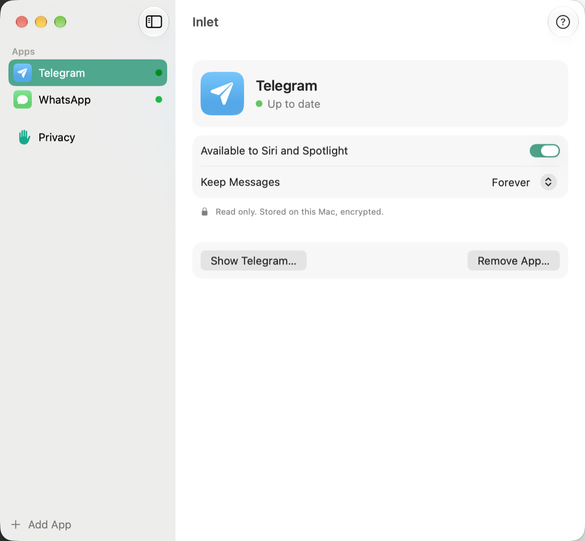
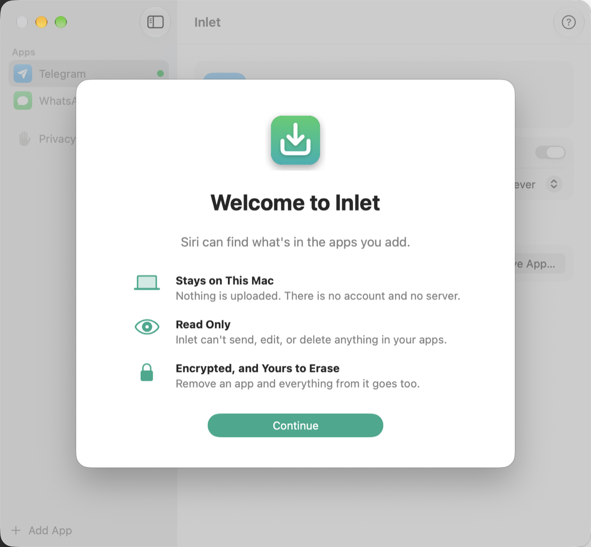
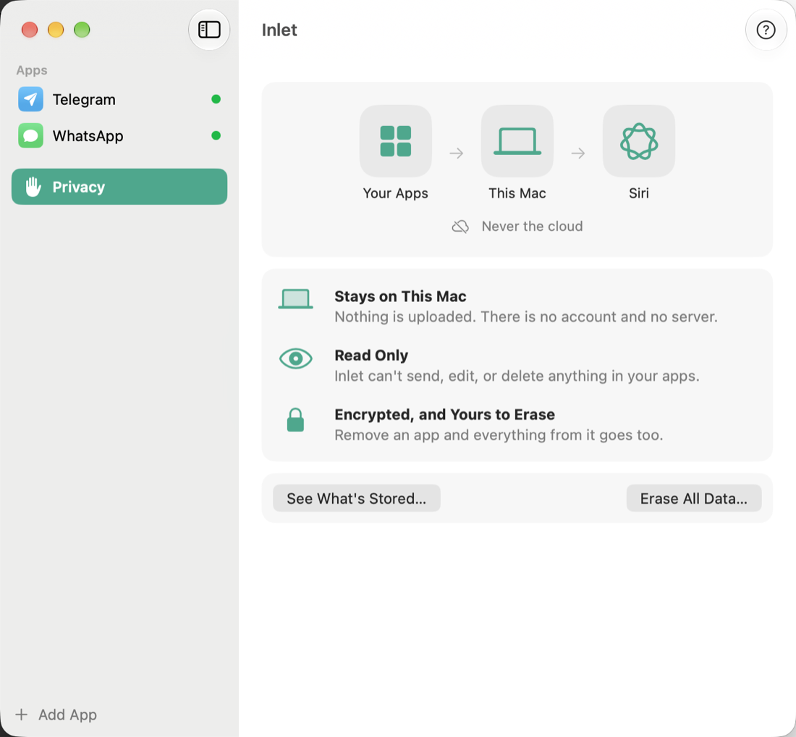
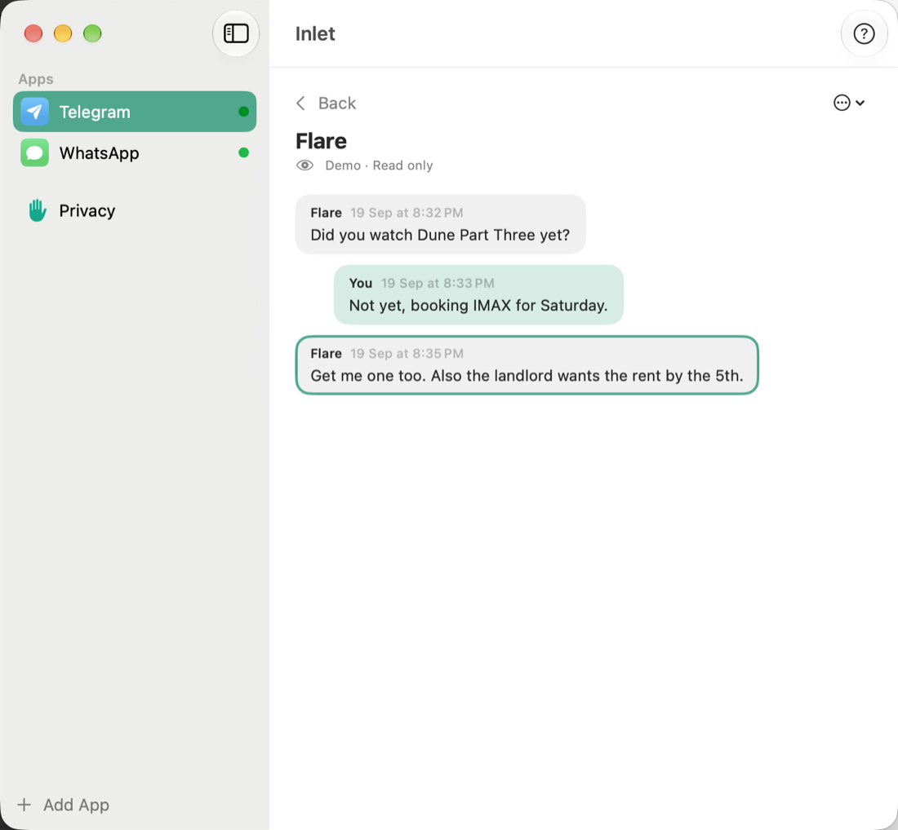

<p align="center">
  
</p>

# Inlet

<p align="center">
  <a href="https://github.com/aniruddha-adhikary/inlet/releases/latest/download/Inlet.dmg">
    
  </a>
  <br>
  <sub>Requires macOS 27 on Apple silicon. Signed and notarized. <a href="https://github.com/aniruddha-adhikary/inlet/releases/latest">Release notes and checksum</a></sub>
</p>

**Let Siri AI and Spotlight find what's inside apps that haven't opened their content to the
system yet.** Add an app in Inlet and sign in to it once. Inlet then lives in the menu bar, reads
new content (read only), and gives it to macOS as App Schema entities.

Messaging apps come first because that is where the gap is widest. The design is not specific to
chats: every app is a catalog entry plus a profile, and each declares what kind of content it brings.

> *"Who got a new cooker?"* → *"Mira mentioned in Inlet that she bought a smart cooker."*

<p align="center">
  
  
</p>
<p align="center">
  
  
</p>

- macOS 27 (Siri AI) only. WhatsApp Web and Telegram Web today.
- **Read-only by construction.** No code path can send, edit, delete or mark anything.
- **Private.** Everything stays on your Mac: sandboxed app, content encrypted at rest, no
  servers, no analytics. See [SECURITY.md](SECURITY.md).

Not affiliated with Apple, WhatsApp, Meta or Telegram. Reading a web client this way is outside
those services' terms of use; it is passive and single-user, but unsupported, and it can break
whenever the web apps change. Use it with your own accounts, at your own risk.

## How it works

```
 embedded web session (WKWebView, hidden after sign-in)
   │  readers/pagestore.js    reads the web app's own in-memory store   ← read-only interpreter
   │  readers/extractor.js    or the DOM, when there is no store
   │  readers/content.js      sends only new or changed records
   ▼  script message (isolated content world, origin-checked)
 app/Inlet/Core/Ingest.swift    canary → normalize onto a schema → id + keyed hash
 app/Inlet/BridgeStore.swift    SQLite; content sealed with AES-GCM (key in the keychain)
   ▼
 app/Inlet/Donor.swift          MessageEntity / ConversationEntity / MessagePerson
                                     → CSSearchableIndex.indexAppEntities
   ▼
 Siri AI · Spotlight · Shortcuts     + "search … in Inlet", answered inside Siri by Apple's
                                       on-device model over the same index (SmartAnswer.swift)
```

Getting Siri to actually *use* third-party content took more than the documentation says. The
findings are written up in [docs/HOW_SIRI_FINDS_YOUR_CONTENT.md](docs/HOW_SIRI_FINDS_YOUR_CONTENT.md);
they should be useful to anyone adopting App Schemas.

## Apps

Every app Inlet offers is described by two kinds of file, both shipped inside the signed bundle:

- `apps/<name>.json`: the catalog entry. Name, kind of content, tile symbol and colour, where to
  sign in, and which hosts the session is confined to. "Add App" lists whatever is in the catalog.
- `profiles/<name>.json`: how to read it.

Each profile is a declarative description (`profiles/*.json`): where the data lives, how fields map
onto a normalized schema, and a **canary** that stops ingestion when the web app changes shape.

| App | Profile | Status |
| --- | --- | --- |
| WhatsApp Web | `whatsapp-web@2` (in-memory store), `@1` (DOM fallback) | verified live |
| Telegram Web K | `telegram-web-k@2` (in-memory mirrors), `@1` (DOM fallback) | verified live |

Want another app? See [docs/WRITING_A_PROFILE.md](docs/WRITING_A_PROFILE.md). Only real gaps,
please: apps no Apple app can ingest and whose publisher hasn't opened reads to Siri.

## Build and install

Most people should use the download above. To build it yourself:

Requirements: macOS 27, Xcode 27, an Apple ID (a free personal team works).

```bash
cp app/Config/Local.xcconfig.example app/Config/Local.xcconfig
```

Put your team id and a bundle id of your own in `Local.xcconfig`, then:

```bash
./scripts/install-app.sh
```

This builds and installs `/Applications/Inlet.app` (Siri ignores apps outside an Applications
folder) and launches it. After the welcome screen, choose **Add Account**, sign in, and the sign-in
window hides itself. From then on Inlet runs from the menu bar.

A distributable DMG:

```bash
./scripts/package.sh
```

It signs with a Developer ID certificate and notarizes when both are available; otherwise the DMG
is development-signed and only runs on Macs registered to your team.

## Diagnostics

The sandbox container is unreadable to other processes, so the app reports on itself. None of
these print message content, except `--smart-test`, which is meant for fixture data.

```bash
/Applications/Inlet.app/Contents/MacOS/Inlet --status
```

Inside the app, **Help > Diagnostics** (the "?" button) shows counts, reader health, and the log.
The main window never does.

`--offline` starts the app without loading any web session. Use it whenever you launch repeatedly
(development, tests), so the services you are signed in to never see a burst of reconnects.

`--show-menu-bar-icon` · `--verify-storage` · `--log-tail 30` · `--release <profile@version>` · `--wipe-index` ·
`--seed-fixtures` · `--remove-fixtures` · `--smart-test "question"`

## Tests

```bash
node --test readers/tests/pagestore.test.mjs
```

```bash
cd app && xcodebuild -project Inlet.xcodeproj -scheme Inlet -configuration Debug -derivedDataPath build -allowProvisioningUpdates test
```

## Repository layout

| | |
| --- | --- |
| `app/` | the Mac app (Swift 6, SwiftUI, App Intents, Core Spotlight, Foundation Models) |
| `readers/` | in-page readers injected into the web sessions, and their tests |
| `apps/` | the app catalog: one JSON file per app Inlet can offer |
| `profiles/`, `schemas/` | reader profiles and normalized schemas |
| `dev/harness/` | optional browser-based harness (Python standard library) with fixture pages for developing profiles |
| `docs/` | [how Siri finds content](docs/HOW_SIRI_FINDS_YOUR_CONTENT.md), [writing a profile](docs/WRITING_A_PROFILE.md), [roadmap](docs/ROADMAP.md) |

## License

[MIT](LICENSE). Contributions welcome: see [CONTRIBUTING.md](CONTRIBUTING.md).
